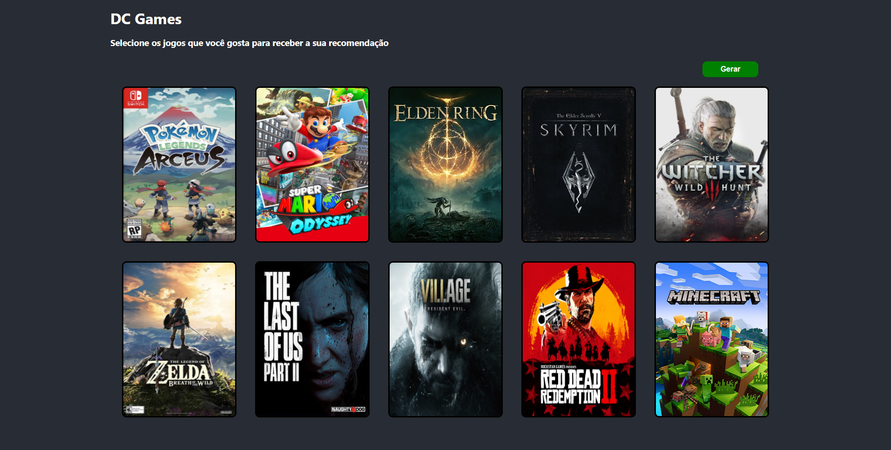
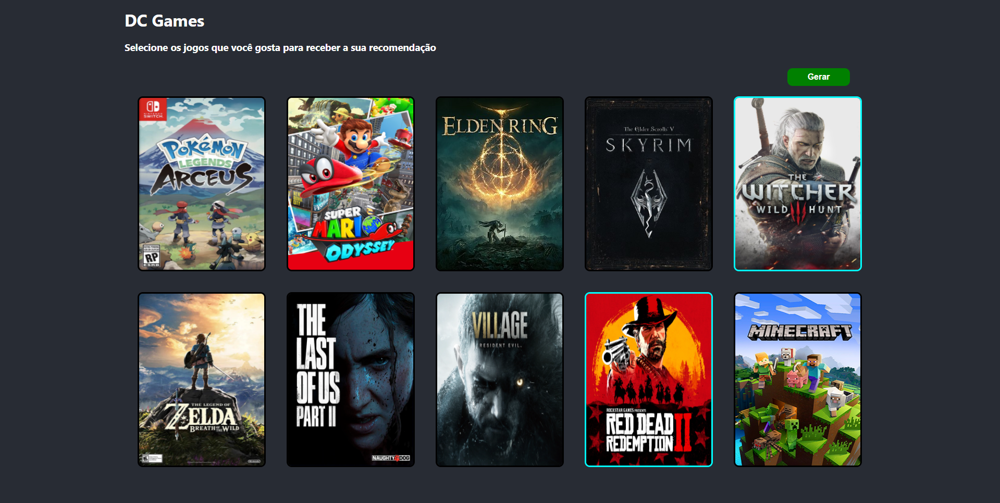
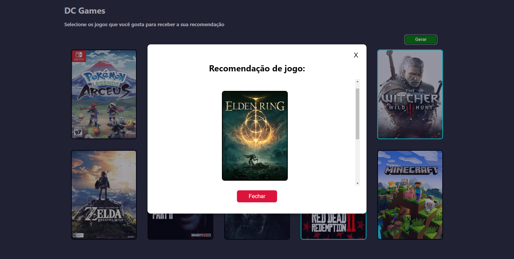
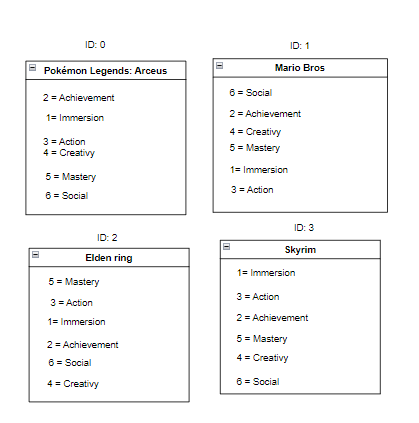
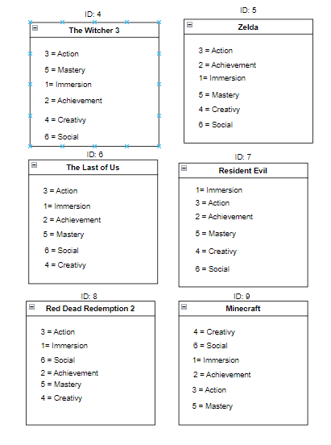

Temas:
 - D&C

# DC Games

**Número da Lista**: 4<br>
**Conteúdo da Disciplina**: Dividir e Conquistar<br>

## Alunos
|Matrícula | Aluno |
| -- | -- |
|  16/0120918 |  Gabriel de Jesus Carvalho |
| 18/0054554  |  	Paulo Batista |

## Sobre 
DC games é um site para recomendar um jogo, baseado no outros jogos que você gostou.

## Screenshots




## Instalação 
**Linguagem**: Python e JavaScript<br>
**Framework**: Flask(backend) e React(frontend)<br>

Para rodar a api é necessário ter o [Python](https://www.python.org/) e o pip instalados e para rodar o frontend é necessário ter o [NodeJS](https://nodejs.org/en/) e o [Yarn](https://yarnpkg.com/) instalados.

Para rodar a api, entre na pasta da api, dentro da pasta do projeto e rode os seguintes comandos:

```
pip install -r requirements.txt
```
E depois suba o servidor rodando:
```
python server.py
```

Para rodar o frontend, entre na pasta frontend, dentro da pasta do projeto e rode os seguintes comandos:

```
yarn install
```

```
yarn start
``` 


## Uso 
Para receber sua recomendação de jogo, basta selecionar o jogos que você curte e clicar em gerar. 

## Outros 
A recomendação é feita utilizando o algorimo de contagem de inversão, para isso, todos os jogos cadastrados no nosso site tem série de características que são utilizadas para que o algoritmo funcione.





